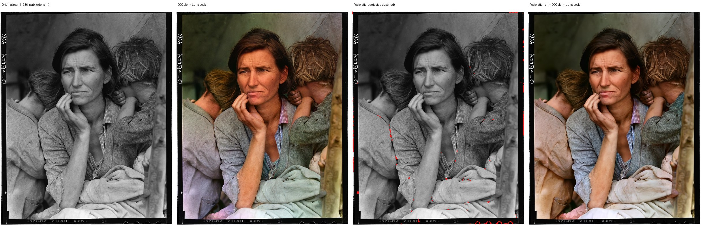

# LumaLock: colourise black-and-white photos in ComfyUI without changing them

A ComfyUI workflow and small custom node pack for turning black-and-white photographs into colour images that look like modern digital photos, while keeping the original photo's structure and detail **exactly**.

How it works: a modern image-editing model suggests the colours. LumaLock then throws away everything the model produced *except* the colour, and puts that colour under the original photo's own brightness at full resolution. Faces, lettering, grain and texture in the result are the original pixels. The model can't redraw a face or change a sign, because nothing from its brightness channel reaches the output.


*The real pipeline running in ComfyUI on Dorothea Lange's "Migrant Mother" (1936, public domain, Library of Congress). This example uses the fast DDColor engine. The recommended Qwen-Image 2.1 engine couldn't be run here (see [What was tested](#what-was-tested)).*

---

## 1. Research: which colourisation method is strongest right now?

| Family | Examples | Colour quality | Control | Structure fidelity |
|---|---|---|---|---|
| Classic automatic networks | DeOldify (GAN), **DDColor** (ICCV 2023), BigColor, ColorFormer | Plausible but often muted or brownish. Limited understanding of what objects are. | None (no prompt, no reference) | Output is pixel-aligned (they predict colour only) |
| Diffusion colourisers (SD 1.5/SDXL era) | ControlNet "recolor", L-CAD, DiffColor, CtrlColor | Better colour variety; text hints; some accept strokes or an example image | Text, strokes, exemplar | Redraw details, so faces and text drift |
| **Instruction-following edit models (2025–26)** | FLUX.1 Kontext, Qwen-Image-Edit 2509/2511, FLUX.2 [klein], **Qwen-Image 2.1** (Sept 2026) | **Best.** Broad world knowledge gives believable skin, materials, uniforms, vehicles, foliage and skies, plus natural colour variety | Plain-language hints ("red dress"), several reference images | Also redraw the whole image. Known to shift or zoom slightly, change brightness and alter fine detail |
| Online services | MyHeritage In Color, Palette.fm, Photoshop Neural Filters | Good | Limited | Not local |

Surveys up to 2025 conclude that diffusion-based and text-guided methods now lead ([Frontiers review, 2025](https://www.frontiersin.org/journals/computer-science/articles/10.3389/fcomp.2025.1626641/full)). Since then, general-purpose edit models have overtaken dedicated colourisers on semantic colour accuracy. Their weaknesses are exactly the ones you ruled out: they shift, re-light and redraw the picture.

**Recommendation:** use a current edit model *only as a colour oracle*, and rebuild the image from the original's luminance:

1. **Colour engine: Qwen-Image 2.1** (7B, open weights, native support in ComfyUI since v0.37.0, released 20 Sept 2026). Why:
   - It fits comfortably on a 24 GB RTX 3090.
   - It works natively up to 2048×2048 (4 MP), so colour boundaries come out sharp.
   - Its encoder node returns a canvas matched to the input, which the ComfyUI team notes prevents the edit from shifting.
   - It accepts up to 16 reference images, which covers your colour-mood photo.

   Sources: [Comfy blog](https://blog.comfy.org/p/qwen-image-21-in-comfyui-open-weight), [ComfyUI docs](https://docs.comfy.org/tutorials/image/qwen/qwen-image-2-1), [weights](https://huggingface.co/Comfy-Org/Qwen-Image-2.1).
2. **Fallback engine: Qwen-Image-Edit-2511** (20B, fp8). Use it if your ComfyUI Desktop doesn't have Qwen-Image 2.1 support yet.
3. **Fast draft engine: DDColor.** Seconds per photo and fully automatic, but its colours are weaker.
4. **LumaLock** (this repo) does the rest for every engine: exact-luminance merge, alignment, edge snapping, white balance, saturation control, colour hints and reference mood.

I could not find any published head-to-head colourisation benchmark for Qwen-Image 2.1, Qwen-Image-Edit-2511 and FLUX.2 [klein]; they are all too new. The ranking above is reasoned from their capabilities and the requirements, not measured.

---

## 2. What the workflow does

```
Photo ─► [2 Restoration, optional] ─► 3 Neutral grey ─┬─► 5 Colour model (proposes colour at ~2.4 MP)
          grain · dust/scratches · faded contrast     │            │
                                                      │            ▼
          4 Hints: text ("red dress"), reference ─────┘   6 LumaLock merge ─► mood ─► white balance ─► mask hint ─► 16-bit PNG
                                                               ▲ original brightness, full resolution
```

| Requirement | How it's met |
|---|---|
| Structure and detail exactly as the original | **LumaLock · Merge** keeps the original CIE L\* (perceptual lightness) and takes only a\*b\* (colour) from the model. Out-of-range colours are fixed by *reducing colour*, never by changing brightness. Measured error: under 0.08 L\* (the smallest visible difference is about 1). |
| Full resolution, any aspect ratio | Colour is generated at about 2.4 MP with the aspect ratio preserved, then applied to the full-resolution original. Large images are processed in strips to keep memory use low. |
| Colour bleeding across edges | (1) Colour is generated at high resolution. (2) Automatic sub-pixel alignment of the model output (shift, zoom and small rotation), which removed 28–34% of colour error in tests. (3) A guided filter snaps colour edges to the original's edges. |
| Washed-out sepia look | Scans are converted to a truly neutral grey first (removing any sepia or colour cast), the prompt forbids sepia and casts, and **Colour Finish** removes leftover casts by making near-grey areas grey. |
| Oversaturation | A soft chroma ceiling (`max_chroma`), plus vibrance (boosts dull colours more than strong ones) instead of blunt saturation. |
| Correct white balance, modern look | Prompt presets ("modern DSLR, neutral daylight", etc.) plus automatic white balance in linear light. |
| Per-region colour hints | **Text:** type `the woman's dress is deep red, the car is pale blue`; the model knows where the dress is. **Mask:** paint the area in ComfyUI's MaskEditor and pick a hex colour; the mask snaps to the photo's edges and only colour changes, so folds and shading stay. |
| Reference photo for colour mood | Fed to the model as a second image ("use only for palette and mood"), **and** a separate statistical transfer of colour mood across shadows, midtones and highlights (`strength` 0.4). |
| Scanned-print problems as a separate step | Group 2, off by default: SCUNet grain removal with a strength control; automatic dust and scratch detection with a red preview; fast fill, or LaMa for tears; faded-contrast repair using one global tone curve (which can't move edges). |

### The custom nodes (category "LumaLock colourise")

| Node | Purpose |
|---|---|
| Neutral Grey | Any scan (sepia, cast, RGB) → neutral grey with identical L\* |
| Restore Tone | Black/white points, midtones, gentle S-curve (global, monotonic) |
| Detect Dust & Scratches | Mask of thin bright/dark defects; conservative by default; `extra_mask` / `protect_mask` inputs |
| Fill Dust & Scratches | Fast pyramid fill (no model) or LaMa (`big-lama.pt`), tiled for big scans |
| Colourise Prompt | Builds the instruction, including your hints and the reference-photo clause |
| Scale For Edit Model | Pixel-budget resize matching Qwen-Image-Edit's internal sizing (used by the 2511 workflow) |
| **Merge Colour Onto Original Luminance** | The core node described above |
| Reference Colour Mood | Palette/mood transfer per tonal band; passes through when no reference is connected |
| Colour Finish | White balance, saturation, vibrance, soft chroma ceiling |
| Region Colour Hint (mask) | Forces a colour inside a painted mask; empty mask = no change |

No extra Python packages are needed. The pack uses only what ComfyUI already ships (PyTorch, spandrel).

---

## 3. Installation (Windows, ComfyUI Desktop, no command line)

### Step 1: update ComfyUI Desktop
Use the app's **Check for Updates** in its menu, then restart. The Qwen-Image 2.1 workflow needs ComfyUI **v0.37.0 or newer** (September 2026). If your Desktop build is older, use the 2511 workflow for now.

### Step 2: install the LumaLock nodes
1. In ComfyUI Desktop, open your custom nodes folder: in the menu choose **Open Custom Nodes Folder**. If you can't find it, it is the `custom_nodes` folder inside the ComfyUI folder you picked at install (by default `Documents\ComfyUI\custom_nodes`).
2. Inside `custom_nodes`, create a new folder named **`ComfyUI-LumaLock`**.
3. On GitHub, open [`comfyui-colorize/ComfyUI-LumaLock.zip`](ComfyUI-LumaLock.zip) and click **Download raw file** (the download arrow).
4. Right-click the ZIP → **Extract All…** → **Browse**, choose the new `custom_nodes\ComfyUI-LumaLock` folder, and click **Extract**. If you get it right, `__init__.py` sits directly inside that folder: `custom_nodes\ComfyUI-LumaLock\__init__.py`. It must not be one folder deeper.
5. **Fully quit** ComfyUI Desktop (close the window) and start it again.

Also fine: if you downloaded the whole repository ZIP, you can copy either `comfyui-colorize` or `comfyui-colorize\ComfyUI-LumaLock` into `custom_nodes`. Both load.

**Still shows "Unknown pack / LumaLock… missing"?** Open the menu → **Open Logs Folder**, open the newest `comfyui.log` in Notepad and search for `LumaLock`. A line saying `IMPORT FAILED` or `Cannot import` names the folder ComfyUI tried and why it failed. If there's no `LumaLock` line at all, the folder is in the wrong place, usually nested one level too deep.

### Step 3: load a workflow
Drag one of these files from `comfyui-colorize\workflows\` onto the ComfyUI canvas:

| File | Engine | Use when |
|---|---|---|
| `LumaLock_Colourise_QwenImage21.json` | Qwen-Image 2.1 | **Recommended** |
| `LumaLock_Colourise_QwenImageEdit2511.json` | Qwen-Image-Edit-2511 | Your ComfyUI doesn't have "Text Encode Qwen Image 2.1" yet |
| `LumaLock_Colourise_DDColor_fast.json` | DDColor | Quick automatic drafts |

### Step 4: download the models (point and click)
When a workflow opens, ComfyUI shows a **Missing Models** dialog with a download button for each file and puts it in the correct folder. You can also download these links in your browser and save them into the named folder (menu → **Open Models Folder**):

**Qwen-Image 2.1 workflow (about 24 GB)**

| File | Folder | Size |
|---|---|---|
| [qwen_image_2.1_bf16.safetensors](https://huggingface.co/Comfy-Org/Qwen-Image-2.1/resolve/main/diffusion_models/qwen_image_2.1_bf16.safetensors) | `models\diffusion_models` | 14.2 GB |
| [qwen3vl_8b_int8_convrot.safetensors](https://huggingface.co/Comfy-Org/Qwen-Image-2.1/resolve/main/text_encoders/qwen3vl_8b_int8_convrot.safetensors) | `models\text_encoders` | 9.4 GB |
| [qwen_image_2.1_vae_bf16.safetensors](https://huggingface.co/Comfy-Org/Qwen-Image-2.1/resolve/main/vae/qwen_image_2.1_vae_bf16.safetensors) | `models\vae` | 0.7 GB |

The full-quality bf16 model (14.2 GB) fits in the 3090's 24 GB. ComfyUI loads the text encoder and the image model one at a time. 32 GB or more of system RAM is recommended.

**Qwen-Image-Edit-2511 workflow (about 31 GB)**

| File | Folder | Size |
|---|---|---|
| [qwen_image_edit_2511_fp8mixed.safetensors](https://huggingface.co/Comfy-Org/Qwen-Image-Edit_ComfyUI/resolve/main/split_files/diffusion_models/qwen_image_edit_2511_fp8mixed.safetensors) | `models\diffusion_models` | 20.5 GB |
| [qwen_2.5_vl_7b_fp8_scaled.safetensors](https://huggingface.co/Comfy-Org/HunyuanVideo_1.5_repackaged/resolve/main/split_files/text_encoders/qwen_2.5_vl_7b_fp8_scaled.safetensors) | `models\text_encoders` | 9.4 GB |
| [qwen_image_vae.safetensors](https://huggingface.co/Comfy-Org/Qwen-Image_ComfyUI/resolve/main/split_files/vae/qwen_image_vae.safetensors) | `models\vae` | 0.25 GB |
| optional: [Lightning 4-step LoRA](https://huggingface.co/lightx2v/Qwen-Image-Edit-2511-Lightning/resolve/main/Qwen-Image-Edit-2511-Lightning-4steps-V1.0-bf16.safetensors) | `models\loras` | 0.85 GB |

**DDColor workflow:** in ComfyUI open **Manager → Custom Nodes Manager**, search **ComfyUI-DDColor** (by kijai), click **Install**, then restart. It downloads its model (0.9 GB) automatically on the first run.

**Restoration (optional, any workflow)**

| File | Folder | Used for |
|---|---|---|
| [scunet_color_real_psnr.pth](https://huggingface.co/deepinv/scunet/resolve/main/scunet_color_real_psnr.pth) | `models\upscale_models` | Grain and noise removal |
| [big-lama.pt](https://github.com/Sanster/models/releases/download/add_big_lama/big-lama.pt) | `models\inpaint` (create the folder) | Filling tears or large damage (optional; "fast fill" needs no model) |

---

## 4. Using it

1. **Load your photo** in the *Black-and-white photo* node (click it and choose a file). Scans of any size and aspect ratio are fine.
2. **Optional restoration:** click the title of the purple group *2 · Restoration* and press **Ctrl+B** to switch it on. Run once and look at the red *Detected damage* preview:
   - If damage is missed, raise `sensitivity` or `max_width_px`.
   - If real detail turns red (catchlights in eyes, hair highlights, patterned fabric, lettering), lower them.
   - For tears or stains, choose `big-lama.pt` in *Fill dust & scratches*.
   - You can also bypass single nodes: for example, keep only *Restore faded contrast*.
3. **Optional text hints:** in *Colourise instruction + colour hints*, pick a `look` and type hints such as `the woman's dress is deep red, the door is dark green`. `scene_notes` accepts context such as `1950s seaside, England`.
4. **Optional mask hint:** right-click the photo node → **Open in MaskEditor**, paint over the area and save. In *Region colour hint* set `colour` (for example `#9e1b24`). For a second region, copy the *Region colour hint* node (Ctrl+C, Ctrl+V), add another *Load Image* with the same photo, paint a different mask on it, and chain the nodes.
5. **Optional reference photo:** click the *OPTIONAL colour-reference photo* node, press **Ctrl+B** to switch it on, and load a modern photo whose colours you like. It is used both by the model and by *Colour mood* (set `strength` to 0 to use it for the model only).
6. Click **Run**. The result is saved as a full-resolution 16-bit PNG in ComfyUI's output folder, and the *Before / after* node shows a comparison slider. For a different colour interpretation, change the KSampler `seed`.

**Tuning cheat sheet**

| Problem | Fix |
|---|---|
| Large areas left grey, "hand-tinted" look | The model under-colourised. Raise the KSampler `cfg` (default 3 with the built-in negative prompt "grayscale, dull, sepia…"; try 4–5) and/or add `colour_hints` for the grey objects (e.g. `walnut wood panelling, blue-grey Air Force uniform`). Check the log line `LumaLock colour: model output median chroma …`: below about 5 means the model's raw output was already dull. |
| Too muted or too strong overall | *White balance & saturation*: `saturation` / `vibrance` |
| Neon patches | Lower `max_chroma` (60–70 is photographic) |
| Yellow or sepia cast remains | Raise `white_balance` to 1.0 |
| Sunset or warm interior looks too cold | Lower `white_balance` (0.3–0.5) |
| Colour spills over an edge | *Keep original brightness…*: `edge_snap` 1.0, or `snap_radius` 3–4 |
| Faster runs | Qwen 2.1: `resolution` 1024 (colour is applied at full resolution anyway). 2511: enable the Lightning LoRA, then steps 4, cfg 1 |
| Maximum quality | Qwen 2.1: `resolution` 2048, 40–50 steps |

---

## 5. What was tested

Everything was run in a CPU-only Linux copy of ComfyUI (v0.38.0, frontend 1.53.6). No GPU was available, so **the Qwen models themselves were not run**.

- **Numerical tests** (`tests/test_lumalock.py`): colour photos were made black-and-white, then a model output was simulated at about 1 MP with a 3/−2 px shift, 1.2% zoom, altered brightness, blurred colour and an alpha channel. Results:
  - The merge reproduces the original luminance to within **0.07 L\*** at the worst pixel (average 0.001).
  - Alignment cuts average colour error by 28–34% compared with a plain resize.
  - White balance, mood transfer and mask hints all keep L\* within 0.35.
  - The dust/scratch detector found 98% of synthetic dust and scratches on a grainy photo, with 0.27% false positives.
- **Tuning data** behind the defaults:
  - When the model's colour is sharp and well placed, a plain resize is most accurate.
  - When the model's colour drifts locally by 1.5–3 px, the edge snap reduces colour error at edges by 6–10%.
  - The default (`edge_snap` 0.6, radius 2) balances both cases. The alignment step matters much more than the snapping.
- **In the real ComfyUI UI** (headless browser): all three workflows load with no missing nodes. Every widget holds the intended value, and bypassed optional parts (restoration, reference photo, LoRA) are routed around correctly.
- **End to end in ComfyUI:** the DDColor workflow ran successfully on the Lange photo, once plain and once with all restoration steps (SCUNet, detection, LaMa fill, tone) switched on. The pictures above are those outputs.
- **Not verified:** colour quality, speed and VRAM use of Qwen-Image 2.1 and Qwen-Image-Edit-2511 on your 3090. The wiring follows ComfyUI's own official templates for both models, but their outputs have not been seen.
- **16-bit saving:** ComfyUI's *Save Image (Advanced)* 16-bit PNG writer rounds values by about 0.0015 on average (measured on a plain grey image). That is about 0.16 L\*, far below the smallest visible difference.

### Limits to know about
- Luminance is locked, so the model **can't fix** tonal problems in the original. Use the restoration group for that.
- Where two differently coloured objects have identical brightness and touch, the edge snap can't separate them. That boundary then depends on the model's own accuracy.
- Automatic dust detection can't always tell dust from fine bright texture. Always check the red preview. Face "restoration" models (CodeFormer, GFPGAN) are deliberately left out because they redraw faces.
- Colourisation is a plausible guess, not a recovery of the true historical colours.

---

## 6. For developers

- `ComfyUI-LumaLock/`: the node pack (`lumalock/color.py` colour maths, `align.py` registration, `restore.py` restoration, `nodes.py` node definitions).
- `ComfyUI-LumaLock.zip`: the same pack zipped flat for easy install. Rebuild it after changing the pack. `__init__.py` in `comfyui-colorize/` lets the parent folder be installed as well.
- `workflows/`: generated by `tools/build_workflows.py` from a running ComfyUI's `/object_info`, so widget order always matches the real nodes.
- `tests/test_lumalock.py`: run with the Python environment from ComfyUI plus `scikit-image` (for the sample photos).

Model licences: check each model's page (Qwen-Image 2.1, Qwen-Image-Edit-2511, DDColor, SCUNet, LaMa) before commercial use.
